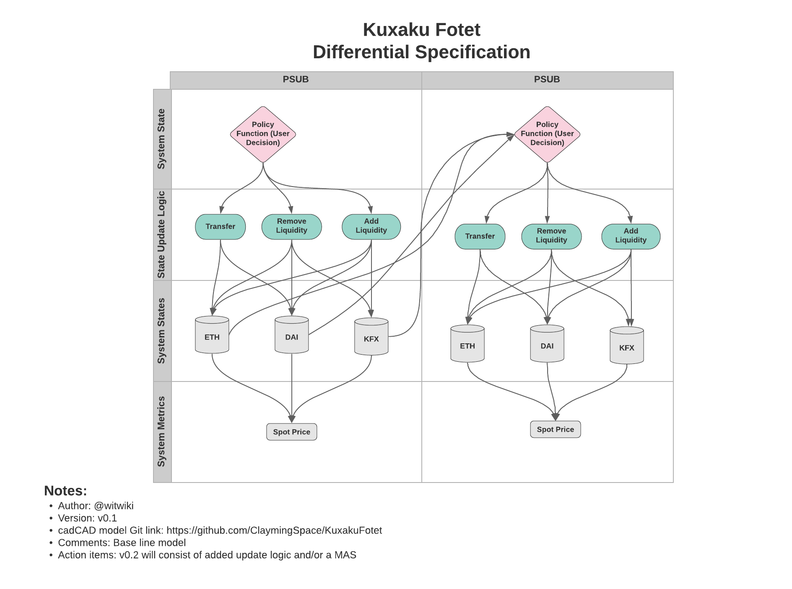

# Kuxaku Fotet Model

## About
This is a **_highly experimental_** cadCAD model of a decentralized (DEX) space commodities market. The name **'Kuxaku Fotet'** comes from <a href="https://expanse.fandom.com/wiki/Lang_Belta">Lang Belta</a> where 'Kuxaku' literally translates to _Space or Vacuum_ and 'Fotet' literally translates to _trade (commerce)_1. 

## Versions
v0.1: This is the baseline version taken directly from cadCAD demo models for Uniswap

## Configuration Management
* The master branch shall contain the production model.
* A staging branch shall exist to stage any changes (prior to being pushed into master) made by developers on their own dev branches.
* Every prior version will be archived out into its own branch.

## cadCAD Specification
This is the cadCAD diff specification for the Kuxaku Fotet DEX

Footnotes:
1. <a href="https://quickref.langbelta.org/">LANG BELTA QUICK REFERENCE</a>

